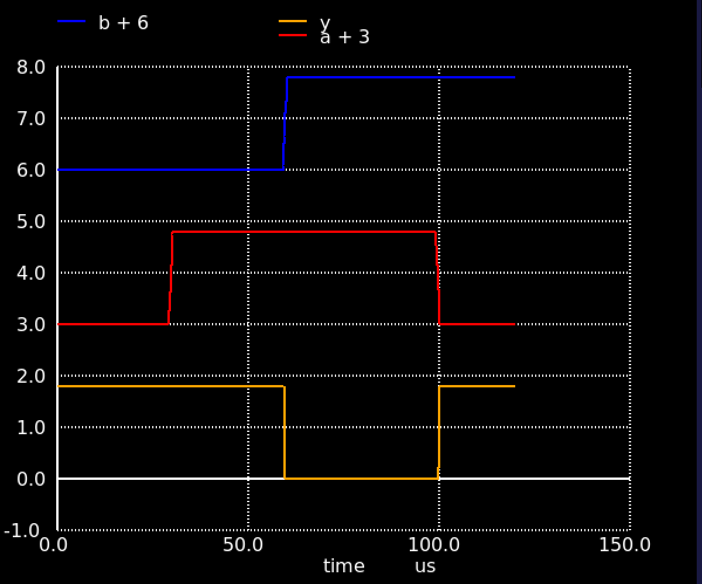

# SkullFET

> Skull shaped MOSFET cells for SKY130 and IHP SG13G2 130 nm processes

## List of cells

- [Inverter](skullfet_inverter.mag)
- [NAND](skullfet_nand.mag)

## Prerequisites

You need to SkyWater's SKY130 PDK installed in order to build the cells. Set the `PDK_ROOT` environment variable to point to the root of the PDK installation. You can use [volare](https://pypi.org/project/volare/) to install the PDK (and then set `PDK_ROOT` to `~/.volare`).

## Usage

- Run `make` to build the GDS/LEF files
- Run `make sim_nand` to run a simulation of the NAND cell (requires [ngspice](https://ngspice.sourceforge.io/)-41 or newer)



## GDS Generation

This project now supports direct GDS generation using the `gdstk` library:

1. Install dependencies:

   ```
   pip install -r requirements.txt
   ```

2. Generate the Inverter GDS file:

   ```
   python scripts/skullfet_gds.py
   ```

   To generate the NAND cell, use:

   ```
   python scripts/skullfet_gds.py -t nand
   ```

Copyright (C) 2021-2025 Uri Shaked
